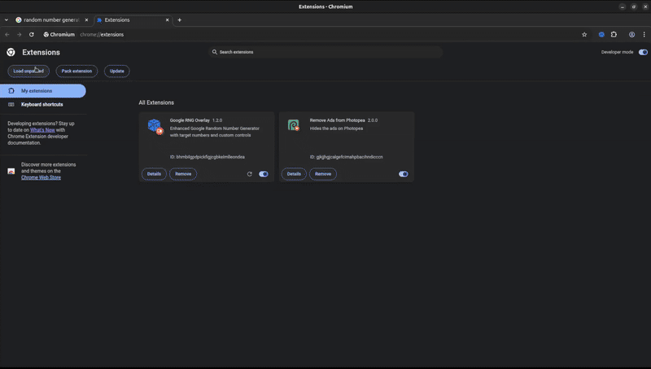

# Google RNG Overlay

A for-fun toy to change the results of the Google random number generator. This browser extension overlays the standard RNG to give you predictable results.

## Demo

## Features

*   **Control the "random" number:** Hijack Google's RNG to get the numbers you want.
*   **Sequential Numbers:** Add a list of numbers, and the generator will follow that sequence.
*   **Shift-Key Activation:** Hold the **Shift** key while clicking "Generate" to get the next number in your list.
*   **Separate UI:** Manage your list of numbers in a separate popup window, which can be operated from the main Google search screen.

## How It Works

1.  **Add Numbers:** Click the extension icon in your browser toolbar to open the popup window. Here, you can add, edit, and reorder the sequence of numbers you want the generator to produce.
2.  **Activate:** On the Google search results page for "random number generator", hold down the **Shift** key and click the **Generate** button.
3.  **Controlled Results:** The generator will now display the next number from your predefined sequence.

## Installation

### Step 1: Open Chrome Extensions
1. Open Chrome browser
2. Go to `chrome://extensions/`
3. Toggle **Developer mode** ON (top right)

### Step 2: Load Extension
1. Click **"Load unpacked"**
2. Navigate to this project folder
3. Select the `dist/` folder
4. Click **"Select Folder"**

### Step 3: Test
1. Go to Google.com
2. Search for "random number generator"
3. You should see the enhanced RNG interface
4. Click the extension icon to manage target numbers
